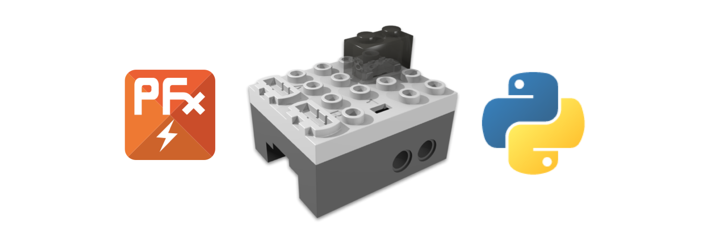

PFx Brick Python API
====================

.. image:: https://travis-ci.org/fx-bricks/pfx-brick-py.svg?branch=master
    :target: https://travis-ci.org/fx-bricks/pfx-brick-py
.. image:: https://img.shields.io/pypi/v/pfxbrick.svg
    :target: https://pypi.org/project/pfxbrick/
.. image:: https://img.shields.io/badge/license-MIT-blue.svg
    :target: https://github.com/fx-bricks/pfx-brick-py/blob/master/LICENSE.md
.. image:: https://img.shields.io/github/issues/fx-bricks/pfx-brick-py.svg?style=flat
    :target: https://img.shields.io/github/issues/fx-bricks/pfx-brick-py.svg?style=flat
.. image:: https://img.shields.io/badge/code%20style-black-000000.svg
    :target: https://img.shields.io/badge/code%20style-black-000000.svg
.. image:: https://github.com/fx-bricks/pfx-brick-py/actions/workflows/test.yml/badge.svg
    :target: https://github.com/fx-bricks/pfx-brick-py/actions/workflows/test.yml/badge.svg

This repository contains a python package API for developing python scripts and applications which communicate with the PFx Brick.  This package supports both USB and Bluetooth LE connections to the PFx Brick and is supported for Windows, macOS and linux.

Getting Started
===============

OS Requirements
---------------

* Supports Windows 10, version 16299 (Fall Creators Update) or greater
* Supports Linux distributions with BlueZ >= 5.43
* OS X/macOS support via Core Bluetooth API, from at least OS X version 10.11

Package Requirements
--------------------

* Python 3.6+
* `HIDAPI <https://github.com/signal11/hidapi>`_
* `Bleak <https://github.com/hbldh/bleak>`_
* sphinx (for documentation)

Installation
============

Pre-install System requirements for linux
-----------------------------------------

The **pfxbrick** package will require some packages to be installed suport access to USB and Bluetooth hardware drivers.  Use your preferred package manager to install these packages:

 * libhidapi-dev
 * libudev-dev
 * libusb-1.0-0-dev
 * bluez
 * bluetooth
 * libbluetooth-dev

Pre-install System requirements for macOS
-----------------------------------------

It is recommended to use the `brew <https://brew.sh>`_ package manager to install the packages for USB hardware access. (Hardware support for Bluetooth will automatically be installed with **pfxbrick** :code:`setup.py` install script which installs the `bleak <https://github.com/hbldh/bleak>`_ package with its dependency to :code:`pyobjc-framework-CoreBluetooth`).

.. code-block:: shell

    $ brew install hidapi

Installation with pip
---------------------

The **pfxbrick** package can be installed with pip:

.. code-block:: shell

    $ pip install pfxbrick

Install from source
-------------------

Install directly from the source code with the :code:`setup.py` script:

.. code-block:: shell

    $ git clone https://github.com/fx-bricks/pfx-brick-py.git
    $ cd pfx-brick-py
    $ python setup.py install

Conda Virtual Environment
-------------------------

You can also use the package in a standalone conda virtual environment. To create a conda environment named :code:`pfxtest`:

.. code-block:: shell

    $ git clone https://github.com/fx-bricks/pfx-brick-py.git
    $ cd pfx-brick-py
    $ conda env create -f environment.yml
    $ conda activate pfxtest
    $ pip install -r requirements.txt
    $ python setup.py install

Basic Usage
===========

After installation, the package can imported:

.. code-block:: shell

    $ python
    >>> import pfxbrick
    >>> pfxbrick.__version__

An example of the package can be seen below

.. code-block:: python

    import time
    from pfxbrick import *

    # Open a PFx Brick session instance
    brick = PFxBrick()
    brick.open()

    # Get the PFx Brick configuration settings
    brick.get_config()
    brick.print_config()

    # Get the user defined name of the PFx Brick
    brick.get_name()
    print(brick.name)

    # Change the user defined name
    brick.set_name('My Cool Brick')

    # Turn on some lights for 5 sec
    brick.light_on([1, 2, 7, 8])
    time.sleep(5)
    brick.light_off([1, 2, 7, 8])

    # Set motor channel A to 50% speed gradually
    for speed in range(50):
        brick.set_motor_speed([1], speed)
        time.sleep(0.1)
    brick.stop_motor([1])

    # Play an audio file with indefinite repeat
    brick.repeat_audio_file("LongBeep1")
    time.sleep(5)
    brick.stop_audio_file("LongBeep1")

    # End the session
    brick.close()

Utility Scripts
===============

The **pfxbrick** package will install some useful command line script applications in your python environment's path.  These include:

* :code:`pfxcat` - dumps the raw contents of a file on the PFx Brick to your console.
* :code:`pfxdir` - shows the directory listing of the PFx Brick file system
* :code:`pfxget` - gets a file from the PFx Brick
* :code:`pfxput` - copies a local host file on to the PFx Brick
* :code:`pfxrm` - delete a file from the PFx Brick
* :code:`pfxrename` - renames a file on the PFx Brick
* :code:`pfxdump` - dumps raw contents of PFx Brick flash memory
* :code:`pfxinfo` - discovers and shows information on all attached PFx Bricks
* :code:`pfxmonitor` - shows real time operational status of a PFx Brick
* :code:`pfxtest` - PFx Brick self test utility
* :code:`pfxplay` - plays an audio file on the PFx Brick
* :code:`pfxrun` - runs a script a file on the PFx Brick
* :code:`pfxscan` - scans for Bluetooth PFx Bricks and shows each brick's information

After installing the **pfxbrick** package, you should be able to use any of these utilities directly from the command line as follows:

.. code-block:: shell

    $ pfxinfo
    ┏━━━━━━━━━━━━━━━━━━━━━━━━━━━━━━━━━━━━━━━━━━━━━━━━━━━━━━━━━━━━━━━━━━━━━━━━━━┓
    ┃ A216 PFx Brick 16 MB                                                     ┃
    ┡━━━━━━━━━━━━━━━━━━━━━━━━━━━━━━━━━━━━━━━━━━━━━━━━━━━━━━━━━━━━━━━━━━━━━━━━━━┩
    │ Serial Number         : AF716069                                         │
    │ ICD Version           : 03.38                                            │
    │ Firmware Version      : 01.50 build 0555                                 │
    │ USB vendor ID         : 0x04D8                                           │
    │ USB product ID        : 0xEF74                                           │
    │ Status                : 0x00 Normal                                      │
    │ Errors                : 0x00 None                                        │
    │ Name                  : My PFx Brick                                     │
    └──────────────────────────────────────────────────────────────────────────┘
    $ pfxdir
     ID Name                       Size    Attr    User1    User2    CRC32
      0 sin150Hz.wav              132.3 kB 0000 000204CE 0000002C A712A54E
      1 pink6dB.wav               132.3 kB 0000 000204CE 0000002C E6AACE61
    2 files, 270.3 kB used, 16490.5 kB remaining

To find out more information on how to use each utility, use without arguments or with the :code:`-h` argument.

.. code-block:: shell

    $ pfxinfo -h
    usage: pfxinfo [-h] [-c]

    Show information for all attached PFx Bricks

    optional arguments:
    -h, --help    show this help message and exit
    -c, --config  Show configuration details

---------------

Documentation
=============

* `PFx Brick Interface Control Document (ICD) v.3.39 <https://github.com/fx-bricks/pfx-brick-dev/raw/master/doc/ICD/PFxBrickICD-Rev3.39.pdf>`_ describes details of PFx Brick operation and communication protocol
* `Python API Reference Documentation <https://www.fxbricks.com/docs/python/index.html>`_

If you want to learn more about PFx Brick, check out `our website <https://shop.fxbricks.com/pages/pfx-test>`_.
