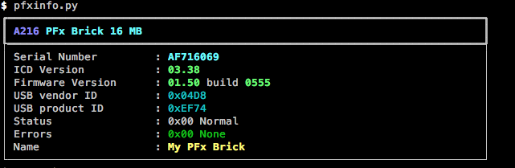
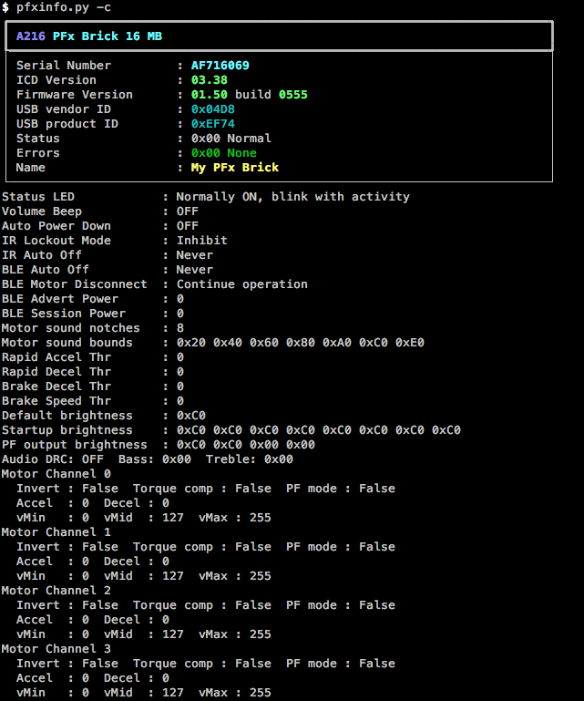
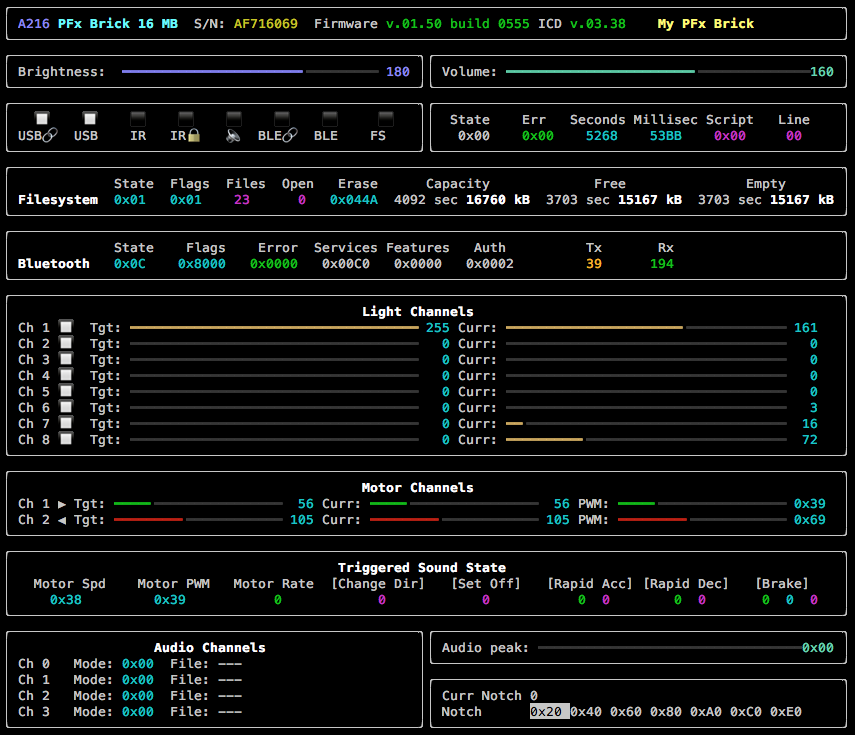
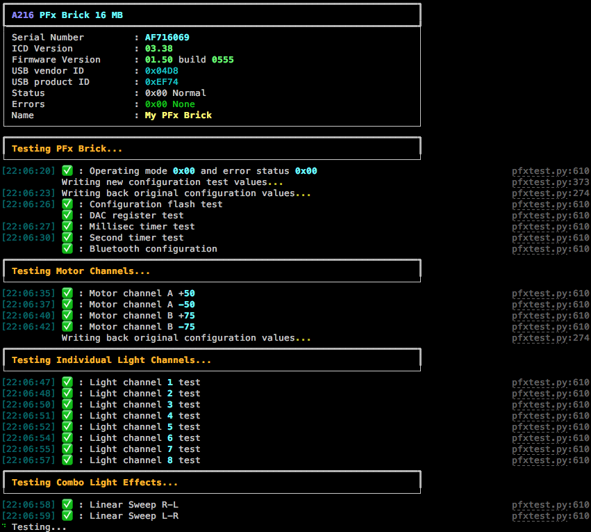

.. _utilities:

***************
Utility Scripts
***************

Installing the pfxbrick python package also installs a collection of useful utility scripts into your python environment path.  These command line scripts can be launched directly from your system's terminal shell / command prompt.

---------------------
File System Utilities
---------------------

pfxdir.py
=========

Show file system directory on PFx Brick.

.. code-block:: shell

    $ pfxdir.py
    232 GMDAccel12.wav             74.2 kB 0040 000121D4 0000002C CEA1669C E8 Accel 1-2
    233 GMDAccel23.wav            124.2 kB 0044 0001E4E0 0000002C 8CAC2EB9 E9 Accel 2-3
    234 GMDAccel34.wav             97.5 kB 0048 00017CB4 0000002C EFEFFB32 EA Accel 3-4
    235 GMDAccel45.wav            100.5 kB 004C 0001883A 0000002C 2271084A EB Accel 4-5
    236 GMDAccel56.wav             78.4 kB 0050 0001323A 0000002C 608E93E4 EC Accel 5-6
    237 GMDAccel67.wav            165.5 kB 0054 00028656 0000002C 8D8E46B2 ED Accel 6-7
    238 GMDAccel78.wav            177.1 kB 0058 0002B392 0000002C DE98DB42 EE Accel 7-8
    224 GMDLoop1.wav               33.3 kB 0020 000081E8 0000002C EAA955E7 E0 Loop 1
    225 GMDLoop2.wav               33.7 kB 0024 0000834A 0000002C 0D6AE9F6 E1 Loop 2
    226 GMDLoop3.wav               27.3 kB 0028 00006A7E 0000002C F3E935CA E2 Loop 3
    227 GMDLoop4.wav               28.1 kB 002C 00006DBA 0000002C A8DB16B3 E3 Loop 4
    228 GMDLoop5.wav               28.5 kB 0030 00006F18 0000002C FE9FDFE9 E4 Loop 5
    229 GMDLoop6.wav               31.1 kB 0034 0000792C 0000002C BDDF1EC9 E5 Loop 6
    230 GMDLoop7.wav               32.1 kB 0038 00007D3C 0000002C 6A25F217 E6 Loop 7
    231 GMDLoop8.wav               28.0 kB 003C 00006D06 0000002C 20849F60 E7 Loop 8
    240 GMDDecel21.wav             87.9 kB 0060 00015750 0000002C B182DF17 F0 Decel 2-1
    241 GMDDecel32.wav             81.5 kB 0064 00013E2E 0000002C D06C3E64 F1 Decel 3-2
    242 GMDDecel43.wav             68.5 kB 0068 00010B94 0000002C E207B4E5 F2 Decel 4-3
    243 GMDDecel54.wav             52.5 kB 006C 0000CCC0 0000002C 78BFCCAE F3 Decel 5-4
    244 GMDDecel65.wav             70.8 kB 0070 0001147E 0000002C 4C45310A F4 Decel 6-5
    245 GMDDecel76.wav             57.4 kB 0074 0000DFFE 0000002C 611161A9 F5 Decel 7-6
    246 GMDDecel87.wav             59.0 kB 0078 0000E676 0000002C 0742832C F6 Decel 8-7
    22 files, 1581.1 kB used, 15179.8 kB remaining

pfxcat.py
=========

Dump the contents of a file to the console.  Similar to the unix `cat` or Windows `type` command.

.. code-block:: shell

    $ pfxcat.py -h
    Usage: pfxcat.py file
    where file is file ID or filename to dump

.. code-block:: shell

    $ pfxcat.py my_script.txt
    #
    # Looping test
    #
    set $A = 0.1
    set $B = 0.1
    set $C = 0.5

    light all off
    repeat 8 {
        light [1] on fade $A
        wait $B
        light [1] off fade $A
        wait $C
    }
    light all off
    $

pfxrm.py
========

Removes a file from the PFx Brick file system.

.. code-block:: shell

    $ pfxrm.py -h
    Usage: pfxrm.py file
    where file is file ID or filename to remove

pfxget.py
=========

Gets a file from the PFx Brick and copies it to your local file system.

.. code-block:: shell

    $ pfxget.py -h
    Usage: pfxget.py file dest
    where file is file ID or filename to get
          dest is optional local file path override for copied file

.. code-block:: shell

    $ pfxget.py GMDLoop1.wav
    Copying file GMDLoop1.wav as GMDLoop1.wav from brick...
    GMDLoop1.wav ━━━━━━━━━━━━━━━━━━━━━━━━━━━━━━━━━━━━━━━━━━━━━━━━━ 100.0% • 33.3/33.3 KB • 28.4 kB/s • 0:00:00

.. code-block:: shell

    $ pfxget.py GMDLoop1.wav ~/tmp/loop1.wav
    Copying file GMDLoop1.wav as /Users/fxbricks/tmp/loop1.wav from brick...
    /Users/fxbricks/tmp/loop1.wav ━━━━━━━━━━━━━━━━━━━━━━━━━━━━━ 100.0% • 33.3/33.3 KB • 28.3 kB/s • 0:00:00

pfxput.py
=========

Copies a file from your local file system to the PFx Brick.

.. code-block:: shell

    $ pfxput.py -h
    Usage: pfxput.py file id
    where file is the local file to copy
            id is an optional file ID to use instead of next available ID

.. code-block:: shell

    $ pfxput.py ~/tmp/loop1.wav
    Copying file loop1.wav to PFx Brick...
    loop1.wav ━━━━━━━━━━━━━━━━━━━━━━━━━━━━━━━━━━━━━━━━━━━━━━━━━━━━ 100.0% • 33.3/33.3 KB • 15.6 kB/s • 0:00:00

.. code-block:: shell

    $ pfxput.py ~/tmp/loop1.wav 10
    Copying file loop1.wav as 10 to PFx Brick...
    loop1.wav ━━━━━━━━━━━━━━━━━━━━━━━━━━━━━━━━━━━━━━━━━━━━━━━━━━━━ 100.0% • 33.3/33.3 KB • 15.6 kB/s • 0:00:00

Copying a file with the same filename as a file that is on the PFx Brick will replace it.

.. code-block:: shell

    $ pfxput.py ~/tmp/loop1.wav
    Replacing file loop1.wav on PFx Brick...
    loop1.wav ━━━━━━━━━━━━━━━━━━━━━━━━━━━━━━━━━━━━━━━━━━━━━━━━━━━━ 100.0% • 33.3/33.3 KB • 23.1 kB/s • 0:00:00

pfxrename.py
============

    Renames a file on the PFx Brick file system.

.. code-block:: shell

    $ pfxrename.py -h
    Usage: pfxrename file newname
    where file is file ID or filename to change
          newname is the new desired filename

.. code-block:: shell

    $ pfxrename.py GMDLoop1.wav NotchLoop1.wav
    Renamed file GMDLoop1.wav to NotchLoop1.wav

-------------------------
General Purpose Utilities
-------------------------

pfxinfo.py
==========

Retrieves basic information from any connected PFx Bricks.

.. code-block:: shell

    $ pfxinfo.py -h
    usage: pfxinfo.py [-h] [-c]

    Show information for all attached PFx Bricks

    optional arguments:
    -h, --help    show this help message and exit
    -c, --config  Show configuration details

pfxrun.py
=========

Runs or stops a script file on the PFx Brick.

.. code-block:: shell

    $ pfxrun.py -h
    Usage: pfxrun.py file [-s]
    where file is file ID or filename of script file to run
    -s optionally stops script execution

.. code-block:: shell

    $ pfxrun.py 0
    Running script file 0

.. code-block:: shell

    $ pfxrun.py -s
    Script execution stopped

pfxplay.py
==========

Plays an audio file on the PFx Brick.

.. code-block:: shell

    $ pfxplay.py -h
    Usage: pfxplay.py file
    where file is file ID or filename of audio file to playback

pfxmonitor.py
=============

Shows real time internal state information of a PFx Brick.

.. code-block:: shell

    $ pfxmonitor.py -h
    usage: pfxmonitor.py [-h] [-s SERIALNO]

    PFx Brick real time monitoring utility. Press <Ctrl>-C to exit monitor.

    optional arguments:
    -h, --help            show this help message and exit
    -s SERIALNO, --serialno SERIALNO
                            Perform monitoring on PFx Brick with specified serial number

.. code-block:: shell

    $ pfxmonitor.py

 

pfxtest.py
==========

Performs self-test diagnostics of various functions of the PFx Brick. 

.. code-block:: shell

    usage: pfxtest.py [-h] [-c] [+b] [-l] [-lc] [-m] [-f] [-a] [+sc] [-t] [-s SERIALNO] [-v]

    PFx Brick self test. Most tests are run by default but individual tests can be omitted using command
    line arguments.

    optional arguments:
    -h, --help            show this help message and exit
    -c, --config          Omit config flash test
    +b, --button          Include button press test
    -l, --lights          Omit light channel test
    -lc, --combo          Omit combo light effects test
    -m, --motors          Omit motor channel test
    -f, --files           Omit file transfer test
    -a, --audio           Omit audio playback test
    +sc, --scripts        Include script execution test
    -t, --time            Dwell time for each combo light effect test
    -s SERIALNO, --serialno SERIALNO
                            Perform test on PFx Brick with specified serial number
    -v, --verbose         Show verbose details of PFx Brick

.. code-block:: shell

    $ pfxtest.py

